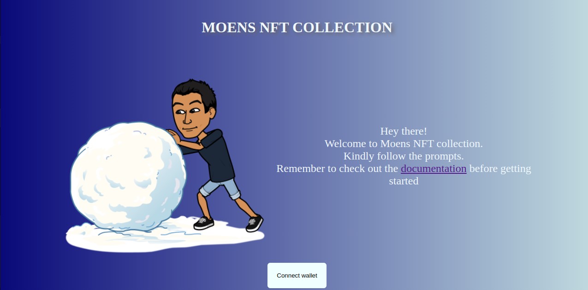
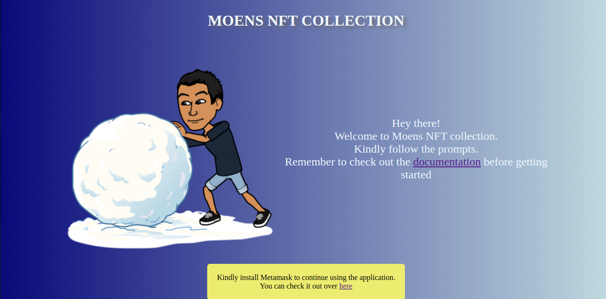
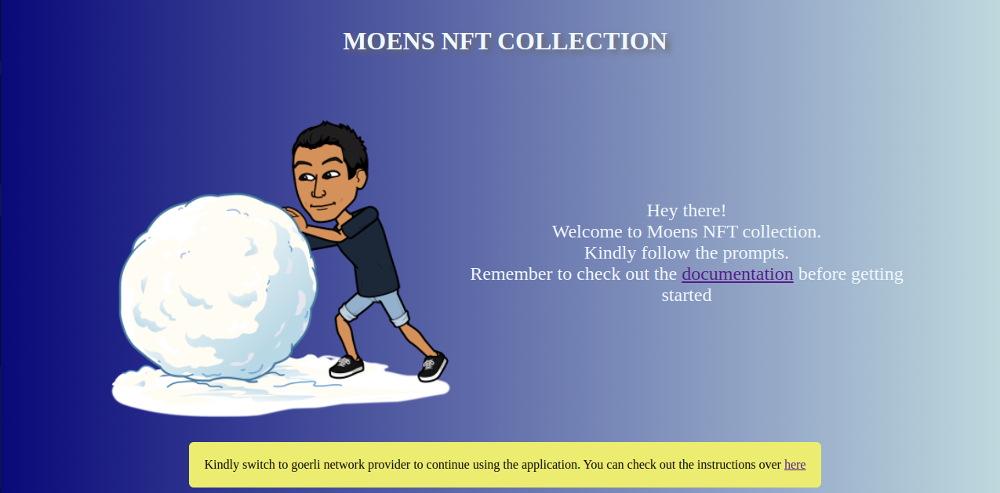
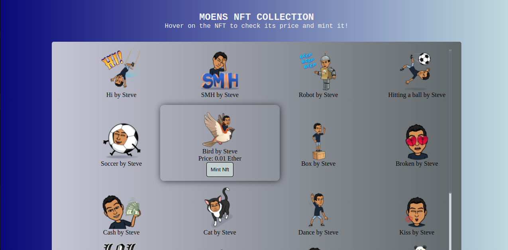
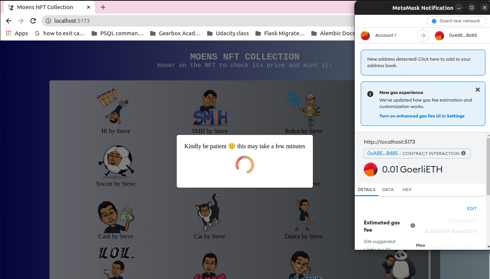
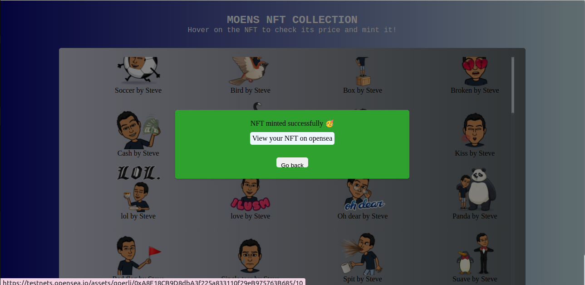
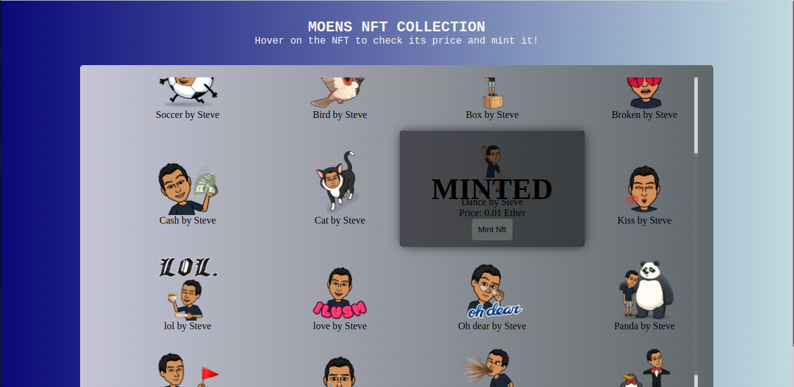

# MOENS NFT COLLECTION
This is a collection of my bitmojis converted into NFTs. 

# Live site link: 
The site can be located over [here](https://moens-nft-collection.netlify.app/)

## DISCLAIMER!!
This site can only work if you have [metamask](https://metamask.io/) installed and you are on the [goerli test network](https://blog.cryptostars.is/goerli-g%C3%B6rli-testnet-network-to-metamask-and-receiving-test-ethereum-in-less-than-2-min-de13e6fe5677#:~:text=Step%201%3A%20Log%20in%20to%20your%20Metamask%20wallet%20and%20click%20on%20the%20dropdown%20of%20networks%3A). 

You also need some [GoerliETH](https://goerlifaucet.com/ ) to be able to mint an NFT. 

Here are a few sites where you can find some free ETH: 
1. https://goerlifaucet.com/ (most recommended)
2. https://faucet.paradigm.xyz/ (You need twitter account to claim GTH)
3. https://faucetlink.to/goerli
4. https://goerli-faucet.pk910.de/

# How to use: 
Once you've landed on the site this is the page that you're supposed to see: 

If you don't have metamask installed, it will give you this warning: 

You can follow the link in order to install metamask. 
Or you can just go to the [official metamask site](https://metamask.io/) to install metamask. 

Once you've installed metamask successfully, you need to switch your network to goerli in order to use the application. 

You can follow the link to see the steps on how to switch your network to goerli. The steps can be found over [here](https://blog.cryptostars.is/goerli-g%C3%B6rli-testnet-network-to-metamask-and-receiving-test-ethereum-in-less-than-2-min-de13e6fe5677#:~:text=Step%201%3A%20Log%20in%20to%20your%20Metamask%20wallet%20and%20click%20on%20the%20dropdown%20of%20networks%3A). 

Once you have metamask installed and you've switched your network to goerli, you can now use the application. 

Click on the "connect wallet" button to connect your wallet. 

# How to mint an NFT: 
Hover over the NFT and you'll see the nft price and the "mint nft" button.

Click on the "mint nft" button and a metamask prompt will appear. 

 

Click confirm. You'll have to wait for a few minutes before the transaction completes. 

Once the transaction is complete you can click on the "view your nft on opensea" button to view your NFT on opensea. 

 

You can also click on the "go back" button to view the other available NFTs. 

If an NFT is already minted. You will see this when you hover over it: 

 

# Contributors: 
[Stephen Kimoi](https://kimoisteve.me/)

Collaborations accepted

